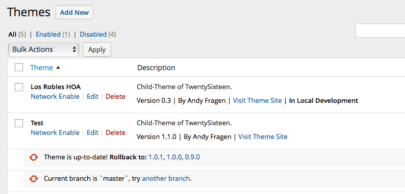

# Local Development
* Contributors: afragen
* Tags: localhost development upgrade plugin theme
* Requires at least: 4.0
* Tested up to: 4.6
* Stable tag: master
* License: GPLv2
* Network: true

Places development notice for plugins or themes that are in local development. Prevents updating of selected plugins and themes.

## Description
Places development notice for plugins or themes that are in local development. Notices are placed on the plugins page and the themes page. Prevents updating of selected plugins and themes.

Pull Requests are welcome at https://github.com/afragen/local-development

Requires PHP 5.3 or greater.

## Installation
If you use this plugin you really shouldn't need these.

1. Upload the entire `/local-development` folder to the `/wp-content/plugins/` directory.
1. Activate the plugin.

## Screenshots

### 1. Local Development Settings

### 2. Plugins Page

### 3. Themes Page

### 4. Multisite Themes Page

