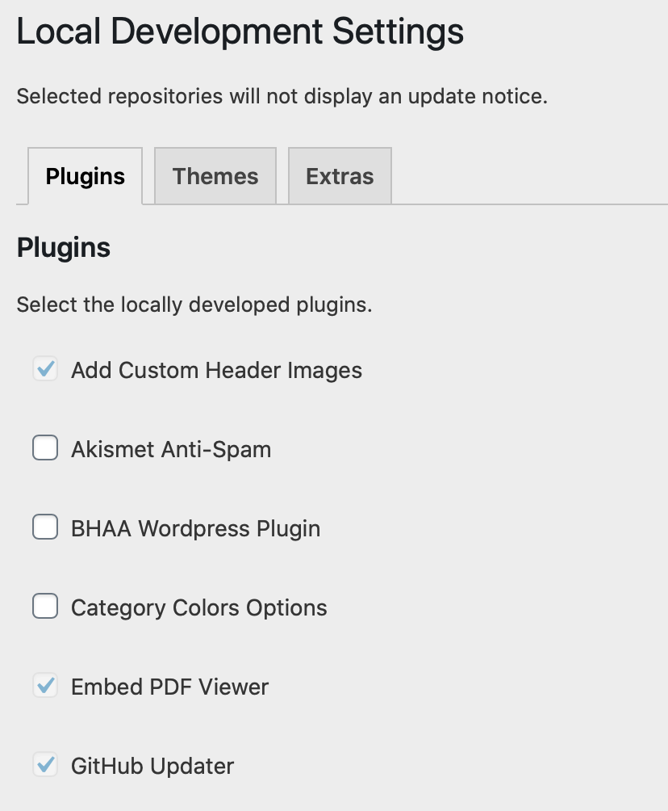
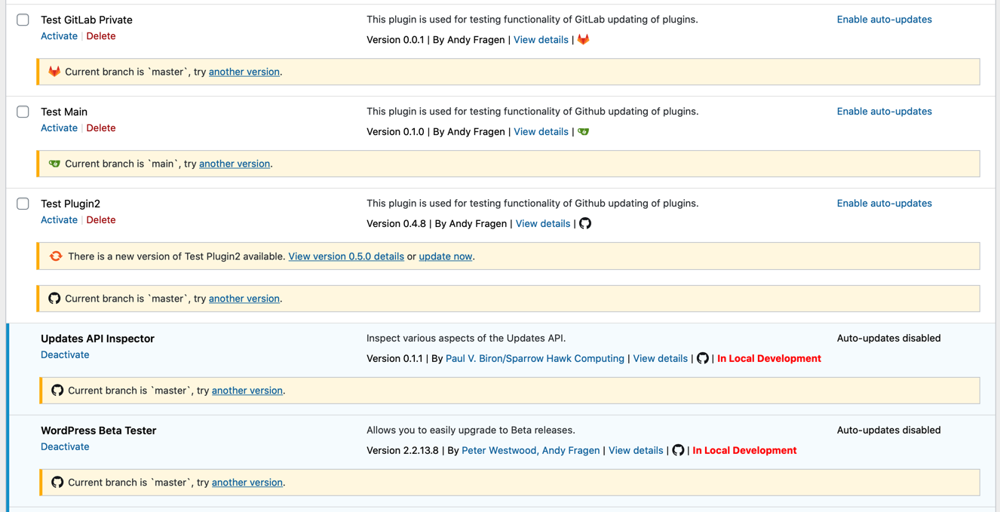
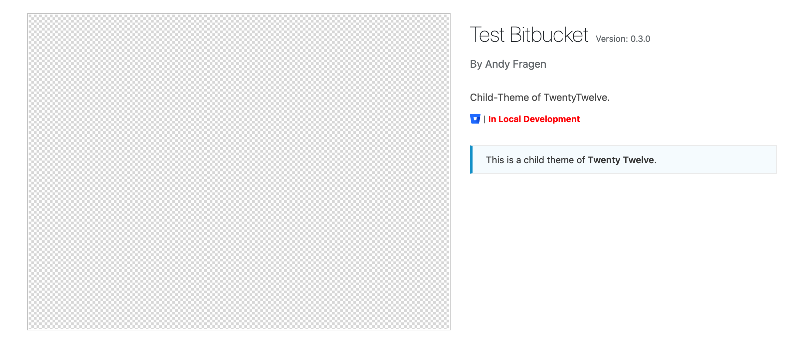
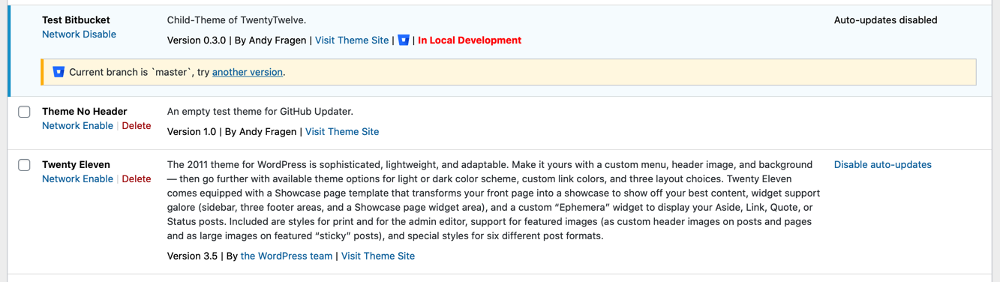

# Local Development
* Contributors: afragen, raruto
* Tags: localhost development upgrade plugin theme
* Requires at least: 4.0
* Requires PHP: 5.6
* Stable tag: master
* License: GPLv2
* Network: true

Places development notice for plugins or themes that are in local development. Prevents updating of selected plugins and themes. Automatically adds plugins and themes under version control. Allows for using a local file server and bypassing the WordPress 5.2 WSOD Shutdown Handler.

## Description
Places development notice for plugins or themes that are in local development. Notices are placed on the plugins page and the themes page. Prevents updating of selected plugins and themes.

Automatically adds plugins and themes under version control.

Allows for using a local file server and bypassing the WordPress 5.2 WSOD Shutdown Handler.

Pull Requests are welcome against the `develop` branch.

Requires PHP 5.6 or greater.

## Screenshots

### 1. Local Development Settings

### 2. Plugins Page

### 3. Themes Page

### 4. Multisite Themes Page

