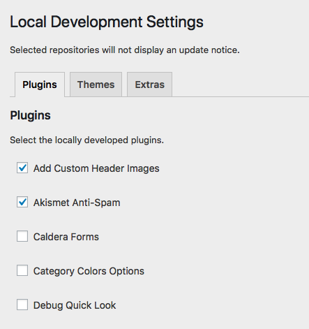
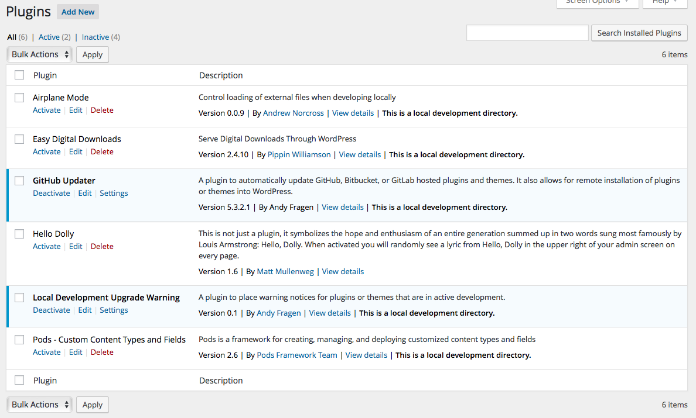
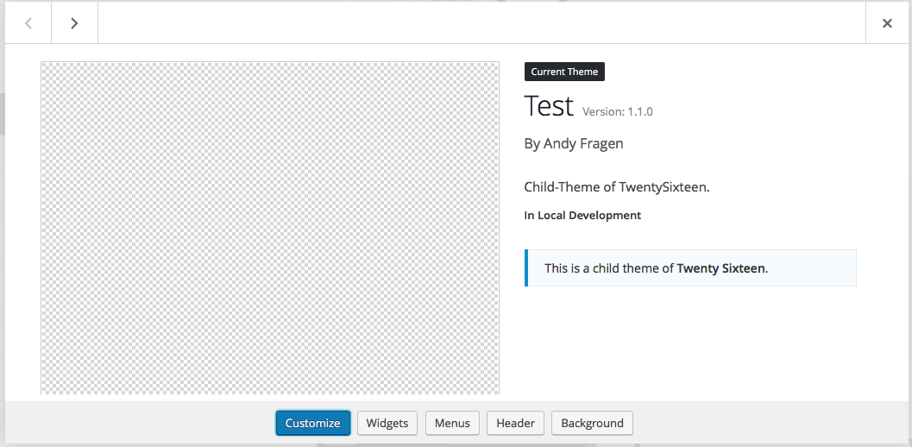

# Local Development Upgrade Warning
* Contributors: afragen
* Tags: upgrade plugin theme
* Requires at least: 4.0
* Tested up to: 4.4
* Stable tag: master
* License: GPLv2
* Network: true

**Developers Only**  
A plugin to place warning notices for plugins or themes that are in active development. Requires PHP 5.3 or greater.

## Description
This is a developer only plugin. Requires PHP 5.3 or greater.

Places warning notices for plugins or themes that are in local development. Warning notices are placed on the plugins page and the themes page. Prevents updating of selected plugins/themes.

## Installation
If you use this plugin you really shouldn't need these.

1. Upload the entire `/local-development-upgrade-warning` folder to the `/wp-content/plugins/` directory.
1. Activate the plugin.

## Screenshots

### 1. Local Development Settings

### 2. Plugins Page

### 3. Themes Page

